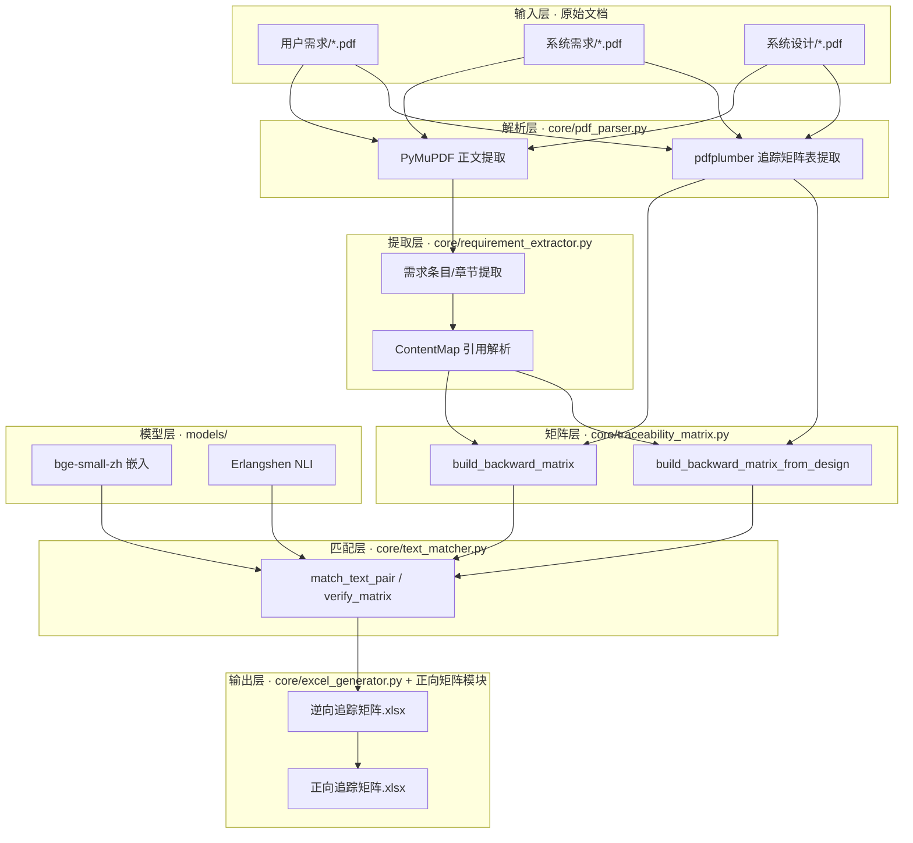

# 核仪控工程文档追踪验证系统 — 设计说明

> [!abstract] 摘要
> 本系统面向核电**仪控（I&C）工程**领域，用于自动化验证上下游工程文档之间的**追踪关系（Traceability）**。核心能力是：把下游文档（如"DCS系统需求说明书""系统设计说明"）中每一条需求，与上游文档（如"用户需求""设备技术规格书""系统需求"）中的对应条目，以**微块级（Micro-block）文本匹配**方式在 Excel 中标注匹配程度：
> - 🟢 **GREEN = 完全一致**
> - 🔵 **BLUE = 语义匹配**
> - ⚫ **BLACK = 未匹配**
>
> 系统由 PDF 双引擎解析、需求条目提取、追踪矩阵构建、微块级文本匹配引擎、Excel 着色生成、以及两类深度学习模型（嵌入 + NLI）组成，并通过逆向/正向两套矩阵分别从下游视角与上游视角呈现追踪覆盖度。

---

## 1. 系统定位与核心概念

### 1.1 业务背景
核电仪控工程存在严格的文档层级链：**用户需求 → 系统需求 → 系统设计 / 软件需求 / 硬件需求**。每一层级的需求必须能够向上游"追踪"其来源，以满足合规审查与需求覆盖度验证。人工核对成本高、易遗漏，本系统提供自动化、可复盘的验证手段。

### 1.2 核心术语

| 术语 | 含义 |
|---|---|
| 下游 / 上游（Downstream / Upstream） | 下游为被验证文档（如系统需求），上游为其溯源文档（如用户需求）。 |
| 逆向追踪矩阵（Backward） | 一行 = 一条下游条目 → 其对应的上游条目（多对一）。 |
| 正向追踪矩阵（Forward） | 一行 = 一条上游条目 → 其对应的多条下游条目（一对多，去重转置）。 |
| 微块（MicroBlock） | 文本经"段落→句子→短语"三级分解后的最小匹配单元。 |
| 匹配类别（MatchCategory） | GREEN（完全一致）/ BLUE（语义匹配）/ BLACK（未匹配）。 |
| 文档层级（DOCUMENT_LEVELS） | 定义各文档目录在追踪链中的角色与层级序号。 |

### 1.3 两种业务流水线
系统当前支持两条独立的追踪链路，二者结构对称、方向相反：

- **流水线 A：系统需求 → 用户需求**（下游=系统需求，上游=用户需求）
  - 入口：`build_backward_matrix(downstream_pdf, upstream_pdfs)`
  - 正向视图：`generate_forward_matrix.py`（用户需求 → 系统需求）
- **流水线 B：系统设计 → 系统需求**（下游=系统设计，上游=系统需求）
  - 入口：`build_backward_matrix_from_design(design_pdfs, sys_req_pdf)`
  - 正向视图：`generate_forward_sd_matrix.py`（系统需求 → 系统设计）

> [!note] 文档层级映射
> `config.DOCUMENT_LEVELS` 定义了目录角色：
> - `用户需求` → upstream, level 0
> - `系统需求` → midstream, level 1
> - `系统设计` / `软件需求` / `硬件需求` → downstream, level 2/3

---

## 2. 系统总体架构

### 2.1 分层架构视图



### 2.2 模块依赖关系
- `app.py` / `run_e2e_*.py` 为**入口层**，编排下方各层。
- `core/traceability_matrix.py` 依赖 `pdf_parser` 与 `requirement_extractor`。
- `core/text_matcher.py` 在运行时**懒加载** `models.*`（避免循环导入、延迟 GPU 占用）。
- `excel_generator.py` 依赖 `text_matcher.TextRun` 与 `traceability_matrix.TraceabilityMatrix`。
- 正向矩阵模块（`generate_forward_matrix.py` / `generate_forward_sd_matrix.py`）独立于 `excel_generator`，直接从已生成的逆向矩阵 Excel（XML 级）读取着色数据，结合上游 PDF 重建正向视图。

### 2.3 关键设计原则
1. **微块级粒度**：在匹配精度与计算开销间取平衡，以"短语"为最小匹配单元。
2. **双向独立匹配**：下游→上游 与 上游→下游 各自分类着色，C 列与 F 列互不干扰；随后通过一致性校验与对称化保证左右视觉一致。
3. **严格分类 + 多级回退**：取消旧版宽松 BLUE 兜底，GREEN/BLUE 均需多重验证（嵌入 + 字符级 / NLI）。
4. **保真重建**：所有着色均从**原文**按坐标切片，避免拼接破坏原始文本与换行。

---

## 3. 配置与常量层（config.py）

集中管理阈值、路径、枚举，是各层共享的"单一事实来源"。

### 3.1 路径常量
| 常量 | 含义 |
|---|---|
| `PROJECT_ROOT` | 项目根目录 |
| `MODEL_DIR` | 模型权重目录 `model/` |
| `EMBEDDER_MODEL_PATH` | bge-small-zh 路径 |
| `NLI_MODEL_PATH` | NLI 模型路径 |
| `OUTPUT_DIR` | 输出目录 `output/` |
| `SYSTEM_DESIGN_DIR` | 系统设计文档目录（新增） |
| `SYSTEM_REQUIREMENT_DIR` | 系统需求文档目录（新增） |

### 3.2 匹配阈值（已调优）
| 常量 | 值 | 含义 |
|---|---|---|
| `EXACT_CHAR_THRESHOLD` | 0.92 | bigram Jaccard 精确匹配门槛 |
| `EMBEDDING_EXACT_THRESHOLD` | 0.95 | 嵌入余弦→进入 GREEN 验证路径 |
| `EMBEDDING_SEMANTIC_THRESHOLD` | 0.70 | 嵌入余弦→进入 BLUE 验证路径 |
| `EMBEDDING_UNMATCHED_THRESHOLD` | 0.50 | 嵌入最低门槛，低于直接 BLACK |
| `NLI_ENTAILMENT_THRESHOLD` | 0.85 | NLI 蕴含概率→BLUE |
| `NLI_NEUTRAL_EMBEDDING_THRESHOLD` | 0.80 | NLI 中立 + 嵌入联合判定→BLUE |
| `MIN_PHRASE_LENGTH` | 4 | 短语最小字符数 |
| `MAX_EMBEDDING_SEQ_LENGTH` | 512 | 模型最大序列长度 |

### 3.3 MatchCategory 枚举
- `GREEN`（exact）：`.color = "00B050"`，`.priority = 3`
- `BLUE`（semantic）：`.color = "0070C0"`，`.priority = 2`
- `BLACK`（unmatched）：`.color = "000000"`，`.priority = 1`
- 优先级用于合并单元格的 Union 着色（`GREEN > BLUE > BLACK`）。

---

## 4. 核心模块职责（core/）

### 4.1 PDF 双引擎解析（pdf_parser.py）

#### 4.1.1 双引擎策略
- **PyMuPDF (`fitz`)**：负责正文文本提取 `extract_body_text()`，段落结构好、速度快；对外统一封装为 `extract_full_text()`（拼接全部页）。
- **pdfplumber**：仅用于追踪矩阵附录表提取 `extract_tables(last_n_pages=8)`，因附录固定在文档末尾。

#### 4.1.2 文本清洗流水线（5 步，PyMuPDF 路径）
1. 清除页眉页脚 / 密级标记（正则匹配 `版本：x 页码：x/x`）。
2. 去除 PDF 私有区 Unicode 字符（U+F000–U+F8FF，Wingdings bullet）。
3. 合并句内换行（CJK→CJK、Latin→CJK 跨行合并；保留段落边界、章节标题、列表项的换行）。
4. 消除 CJK-Latin / Latin-Digit / 列表编号后的 PDF 伪空格。
5. 清理孤立 bullet 碎片。

> [!info] 章节标题识别
> `_SECTION_HEADING_RE` 在合并前预扫描标记所有章节标题行，避免被误并入上一行，保障下游章节型提取准确。

#### 4.1.3 追踪矩阵附录表解析（两类文档）
- **系统需求类** `find_traceability_table` / `parse_traceability_table`：表头含"条目号/追踪/上游"，典型结构 `[本文需求条目号, 上游文件章节/需求号, 说明]`，处理多值单元格（按换行拆分并对齐文档名）。
- **系统设计类** `find_traceability_table_design` / `parse_traceability_table_design`（新增）：表头含"设计条目号/需求条目号"，支持两类结构：
  - Type A（2 列）：`[设计条目号, 需求条目号]`
  - Type B（3 列）：`[其他, 设计条目号, 需求条目号]`
  - 需求条目号列为多值时展开为多条 `TraceRelation`，上游文档固定为"系统需求"。

关键数据结构：`PageText`、`TableData`、`TraceRelation(downstream_id, upstream_ref, upstream_doc)`。

### 4.2 需求提取与内容映射（requirement_extractor.py）

#### 4.2.1 文档类型检测 `detect_document_type`
全文正则匹配 `<xxx>` 格式 ID，去重后 ≥3 个 → **ID 型**，否则 → **章节型**。

#### 4.2.2 条目 / 章节提取
- **ID 型** `extract_requirement_items`：每个 ID 内容 = 该 ID 结束到下一个 ID 开始之间的文本；同 ID 多次出现保留最长版本；过滤过短附录引用（阈值 = `max(20, 中位数×0.15)`）；超长条目二次清洗 ASCII 噪声。
- **章节型** `extract_sections`：匹配 `3.2.2.1 F-SC1级要求` 等章节号+标题，内容取到下一章节前。

#### 4.2.3 ContentMap 多策略引用解析（6 级回退）
1. 精确 ID 匹配
2. 归一化 ID 匹配（去空格、统一全半角）
3. 精确章节号匹配
4. 精确 full_key（`章节号+标题`）匹配
5. 子串匹配 + 章节号前缀匹配（最长匹配优先）
6. 模糊匹配（difflib `SequenceMatcher ≥ 0.7`）

#### 4.2.4 内容清洗与噪声剥离 `_clean_content`
- 折叠连续换行为单行；逐行 strip。
- 移除 ASCII 架构图 / 表格噪声（`_remove_ascii_diagrams`：连续≥3 噪声行或噪声占比>30% 时整块清除）。
- 剥离尾部泄漏的**章节标题**（`_strip_trailing_headings`）与**附录表引用文本**（`_strip_trailing_appendix_refs`），防止正文越界。

### 4.3 追踪矩阵构建（traceability_matrix.py）

#### 4.3.1 数据模型
- `TraceabilityRow(seq_number, downstream_id, downstream_content, upstream_doc, upstream_ref, upstream_content, match_result)`
- `TraceabilityMatrix`：行列表 + `backward_merge_groups`（下游侧一对多合并）/ `forward_merge_groups`（上游侧一对多合并）。
- `to_forward_format()`：按 `(upstream_doc, upstream_ref)` 重新分组，产出正向矩阵行。

#### 4.3.2 逆向矩阵构建（两类入口）
- **`build_backward_matrix`**（流水线 A）：解析下游 PDF 附录表 → 提取下游内容映射 → 为各上游文档构建 `ContentMap` → 按下游条目分组填充 → 计算合并组。
- **`build_backward_matrix_from_design`**（流水线 B，新增）：遍历多份系统设计 PDF 的附录表（Type A/B）→ 构建系统需求内容映射（单一上游）→ 按 `(doc_name, ds_id)` 分组填充。

> [!warning] 跨文档回退策略变更
> 当前 `build_backward_matrix` 中已**取消"指定文档解析失败时尝试所有其他上游文档"**的回退，以避免跨文档内容串稿，仅保留同一文档内的模糊匹配。

#### 4.3.3 合并组计算
- `compute_backward_merge_groups()`：同 `seq_number` 下多行 → 下游侧 A/B/C 列合并。
- `compute_forward_merge_groups()`：正向矩阵上游侧 A/B/C 列合并。

### 4.4 微块级文本匹配引擎（text_matcher.py）— 系统核心

#### 4.4.1 数据模型
- `MicroBlock(text, level, start, end, category, children, clean_text)`：`level` 0=段落/1=句子/2=短语；`children` 存储子短语 GREEN 的 `(start, end, len)`；`clean_text` 为提纯后文本（用于嵌入编码）。
- `TextRun(text, category)`：着色运行单元，一一对应 Excel 富文本的 `<r>`。
- `MatchResult(downstream_runs, upstream_runs, overall_category, downstream_text, upstream_text)`。

> [!note] 动态属性 `_clean_start`
> 在 `_remap_block_positions` 之前，代码动态为 block 注入 `b._clean_start = b.start`，记录该块在 **cleaned-text 坐标**中的起始位置，供后续子短语 GREEN 做坐标重映射（见 4.4.2）。

#### 4.4.2 坐标系统（关键实现细节）
文本经过噪声清理与归一化后，块的位置坐标需经历两次空间：
- **cleaned-text 坐标**：噪声清理 / 前缀归一化后的坐标，由 `pos_map` 映射到原文。
- **original-text 坐标**：原始 PDF 文本坐标，最终着色切片基于此。

流程：
1. `decompose_text(clean_text)` 得到块，记录 `block.start/end`（cleaned-text 坐标）。
2. 保存 `block._clean_start = block.start`。
3. `_remap_block_positions(blocks, pos_map)`：用 `pos_map` 将 `start/end`（以及已有 `children`）从 cleaned-text 坐标改写为 original-text 坐标。
4. 子短语 GREEN 找到的 children 位于块文本本地坐标，需经 `_clean_start + 本地坐标 → pos_map → original-text 坐标` 还原，确保着色精准贴合原文。

#### 4.4.3 match_text_pair 流水线（逐对匹配入口）
完整阶段见第 6 节。宏观上依次执行：预处理 → 嵌入编码 → 最优匹配 → 双向分类 → 子短语 GREEN → 双向一致性 → 对称着色 → 着色重建。

### 4.5 Excel 生成（excel_generator.py）

#### 4.5.1 CellRichText 着色
- 使用 openpyxl `CellRichText` + `TextBlock` + `InlineFont`，每个 `TextRun` 一个独立 `<r>`，颜色由 `category.color` 决定。
- 正确处理 `\n` 换行（inline string `<t>` 元素保留）。
- 逆向矩阵 Sheet（6 列）：`序号 / 下游条目号 / 下游内容 / 上游文档 / 上游条目号·章节 / 上游内容`。

#### 4.5.2 合并单元格与 Union 着色
- 一对多关系通过合并 A/B/C（下游）或 A/B/C（上游）列实现。
- `_union_text_runs`：同一下游条目对应多行时，对每个字符位置取最高优先级颜色（`GREEN>BLUE>BLACK`），直观体现"需求覆盖完成度"。

---

## 5. 模型调用原理（models/）

> [!info] 模型内嵌
> 模型权重位于 `model/` 目录（embedder / nli），**无需联网下载**。`model/sentence_transformers/` 虽内嵌，但当前代码直接用 `transformers.AutoModel` 加载，不依赖该库。

### 5.1 嵌入模型（embedding_model.py）
- **bge-small-zh**（BAAI）：4 层 BERT，hidden_size=512，24M 参数，约 96MB。
- `encode(texts, batch_size=32)` → `(N, 512)` L2 归一化向量；采用 **Mean Pooling（带 attention mask）**。
- `cosine_similarity_matrix(a, b)` → 因向量已归一化，直接 `a @ b.T`。
- 加载方式：`AutoModel` 直接加载（规避 sentence-transformers 版本兼容问题）。

### 5.2 NLI 模型（nli_model.py）
- **Erlangshen-Roberta-110M-NLI**：12 层 BERT，hidden_size=768，110M 参数，约 409MB。
- 3 分类：`CONTRADICTION(0) / NEUTRAL(1) / ENTAILMENT(2)`。
- `predict_batch(pairs, batch_size=16)` → 每对 `{"CONTRADICTION","NEUTRAL","ENTAILMENT"}` 概率。

### 5.3 懒加载与设备选择
- 两模型均在首次调用时 `_load_model()` 初始化，自动检测 CUDA（校验 `compute_capability ≤ 90` 以防架构不兼容）→ 回退 CPU。
- `text_matcher` 在函数体内 `from models... import` 实现懒加载，避免循环导入与过早占用 GPU。

---

## 6. 文本匹配算法详解

> 本节聚焦核心模块 `text_matcher.py`，按 `match_text_pair` 的执行顺序（宏观→微观）展开。

### 6.1 三级微块分解（`decompose_text`）
```
段落（按 \n 分割）
  └→ 句子（按 。；；！？？ 分割）
       └→ 短语（按 ，、：；。. \n / —— 分割）
```
- 短语分割正则：`(?<=[，、,：:；;.。\n])\s*|(?=——)`
- 列表项正则：`^\s*(\d+[)）]|[a-zA-Z][)）]|[-•●](?:\s|(?=[\u4e00-\u9fff])))`
- 过短短语（< `MIN_PHRASE_LENGTH`）与相邻合并，保持位置追踪。
- 每个微块记录 `(start, end)`，后续从原文切片保真重建。
- `decompose_text` 后对每个短语执行**结构化短语提纯** `_purify_phrase`，结果存入 `clean_text`（用于嵌入编码；原文 `text` 仍用于着色）。

### 6.2 Pre-Stage：预处理
1. **ASCII 噪声清理** `_strip_ascii_noise_for_matching`：仅对长度≥100 的文本，检测连续≥2 行无 CJK 的短 ASCII 行（或技术标签 `PIPS-1` 等），移除并返回 `(cleaned_text, pos_map)`。
2. **段落级前缀归一化** `_normalize_text_for_decomposition`：去除行首列表标记，合并因 PDF 换行导致的碎片化短行（<15 字符非列表项），返回 `(normalized_text, pos_map)`。

### 6.3 Stage 0：嵌入编码
- 对每个微块使用 `clean_text`（提纯后）编码；计算余弦相似度矩阵 `(M×N)`。

### 6.4 Stage 1：最优匹配（`_optimal_matching`）
- 使用 **匈牙利算法** `scipy.optimize.linear_sum_assignment` 计算最优二分匹配。
- 约束：相似度 < `EMBEDDING_UNMATCHED_THRESHOLD` 的位置设代价 100（不会被选中）。
- 回退：`scipy` 不可用时用 `_constrained_greedy_matching`（按相似度降序、每侧最多匹配一次，避免多对一冲突）。
- 返回 `ds_matches`（下游→上游）与 `up_matches`（上游→下游）两个方向映射。

### 6.5 Stage 2：分类判定（`_classify_block`）
对下游→上游与上游→下游**双向独立**执行。决策树（严格无兜底 + 多级回退）：

```
嵌入相似度 < 0.50 ?
  └→ 是 → BLACK（直接排除）

嵌入相似度 ≥ 0.95 ?
  └→ GREEN 路径（精确验证）
       ├─ 路径1: bigram Jaccard ≥ 0.92 → 通过
       ├─ 路径2: char_set Jaccard ≥ 0.88 且 LCS 比率 ≥ 0.80 → 通过
       └─ 通过后检查: 长度比 ≥ 0.70 → GREEN；否则降级

Stage 2a-fast: 双方原文完全一致且 ≤10 字符 → GREEN（绕过嵌入/bigram）
Stage 2a-fallback: 嵌入 ≥0.85 + 归一化后文本完全一致 + 长度 ≥4 + 长度比 ≥0.50 → GREEN

嵌入相似度 ≥ 0.70 ?
  └→ BLUE 路径（语义验证，调用 NLI）
       ├─ 矛盾概率 ≥ 0.80 → BLACK
       ├─ 蕴含 ≥ 0.85 且 char_set ≥ 0.35 → BLUE
       │   └─ 或 蕴含 ≥ 0.90 且 char_set ≥ 0.30 → BLUE（容忍分解粒度差异）
       ├─ 中立 ≥ 0.80 且 嵌入 ≥ 0.80 且 char_set ≥ 0.40 → BLUE
       └─ 否则继续

Stage 2c: 嵌入 ≥ 0.85 + (LCS ≥ 0.55 或 char_set ≥ 0.60) → BLUE（无需 NLI）
Stage 2d: 嵌入 ≥ 0.75 + char_set ≥ 0.55 + LCS ≥ 0.45 → BLUE

其余 → BLACK
```

> [!note] NLI 调用受门控
> NLI 仅在 `embedding_sim ≥ EMBEDDING_SEMANTIC_THRESHOLD(0.70)` 时才被调用，且当前实现为**逐对** `predict_batch([(a,b)])`（见 §11.4 优化方向）。

### 6.6 Stage 3：子短语 GREEN 扫描（`_apply_subphrase_green`）
当短语级为 BLACK 时，在块内部查找与对侧**完全一致**的子串标为 GREEN。
- 实际阈值（代码常量）：`_MIN_GREEN_SUBSTR_LEN = 4`，`_MIN_BLOCK_SIM_FOR_SUBPHRASE = 0.45`，`_MAX_GREEN_SUBSTRS_PER_BLOCK = 3`。
  > ⚠️ 旧文档记作 8 / 0.60，与当前代码不符，已在此修正。
- 算法：取 top-5 候选 → DP 查找最长公共子串（≥4 字符，归一化后比较）→ bigram Jaccard ≥ 0.92 验证 → 去重（移除被包含短串）→ 贪心选非重叠集合（最多 3）→ 验证 GREEN 总长 ≤ 块文本 90% → **坐标映射**写入 `block.children`。
- 双向独立执行：下游→上游、上游→下游各一次。

### 6.7 Stage 4：双向标色一致性校验（`_ensure_bidirectional_consistency`）
- 当一侧为 GREEN/BLUE 而其对侧块为 BLACK 时，取较高类别统一。
- 升级门槛：含 children 时用 `_MIN_BLOCK_SIM_FOR_SUBPHRASE`（0.45），否则用 `EMBEDDING_SEMANTIC_THRESHOLD`（0.70）。
- **仅同步块级类别**，不同步子短语 children。

### 6.8 Stage 5→6：对称着色（TextRun 级）
- `_blocks_to_runs`：将微块合并为 `TextRun`，相邻同色合并，从原文切片保真；有 children 时调用 `_blocks_to_runs_subphrase` 细粒度交替 GREEN/BLACK（含重叠回退安全路径）。
- **Stage 6 对称化** `_symmetrize_text_runs`（新增）：以对侧 GREEN run 为参照，在本侧 BLACK run 中查找相同子串并标绿，消除左右视觉不对称。替代了原先依赖未实现辅助函数的子短语交叉标记方案（见 §11.3）。

### 6.9 字符级相似度函数
| 函数 | 算法 | 用途 |
|---|---|---|
| `_char_bigram_jaccard` | 字符二元组集合 Jaccard | GREEN 路径1（最严格） |
| `_char_set_jaccard` | 去重字符集 Jaccard | GREEN 路径2 + BLUE 重叠验证 |
| `_lcs_ratio` | 最长公共子序列比率（O(n²) DP，200 字符截断，滚动数组） | GREEN 路径2 + BLUE 回退 |
| `_normalize_for_char_compare` | 全角→半角、去 PUA、去 bullet/编号前缀/功能后缀、PDF 字符混淆归一化 | 所有字符级比较前置 |

`_normalize_for_char_compare` 步骤：全半角映射 → 去 PUA → 去列表标记 → 去编号前缀 → 去空格换行 → 去尾部标点 → 去功能后缀 → **上下文感知 PDF 字符混淆归一化**（`l→1`：大写/数字上下文；`O→0`：数字序列中）。

### 6.10 短语提纯（`_purify_phrase`）
提升嵌入编码质量：去编号前缀（`1)`/`a)`/`- `）→ 去尾部标点 → 去功能类型词后缀（长度>10 时去除 `功能|系统|模块|装置|单元|组件`）。提纯文本 `clean_text` 用于编码，原文 `text` 用于着色。

---

## 7. 正向追踪矩阵生成

两类正向矩阵模块结构对称，均**不从零重跑匹配算法**，而是复用逆向矩阵已着色的运行数据。

### 7.1 用户需求 → 系统需求（`generate_forward_matrix.py`）
- `generate_forward_matrix(reverse_path, user_pdf_dir, forward_path, sys_req_dir)`
- 五步：① XML 级 RichText 读取 `_read_reverse_matrix_data`（直接解析 xlsx 内联字符串 runs，绕过 `data_only` 颜色丢失；处理下游合并单元格继承）② PDF 完整条目提取 `_extract_pdf_items`（ID 型仅取需求条目，章节型标题截断防泄漏）③ 引用匹配 `_match_ref_to_item`（精确→子串→章节号前缀→模糊，4 级回退）④ Union Coloring `_compute_union_coloring`（GREEN>BLUE>BLACK）⑤ `generate_forward_excel`（每份用户文档一 sheet，上游合并+union 着色，下游按追踪关系独立着色，无追踪填 NA）。

### 7.2 系统需求 → 系统设计（`generate_forward_sd_matrix.py`，新增）
- `generate_forward_sd_matrix(reverse_path, sys_req_pdf_dir, forward_path, design_pdf_dir)`
- 与 7.1 同构，方向相反：以**系统需求 PDF** 条目为基准（完整覆盖），将逆向矩阵（系统设计→系统需求）的行匹配回系统需求条目，计算 union 着色，下游（系统设计）按追踪关系独立着色，未追踪条目下游填 NA。
- 设计文档名通过 `_infer_design_doc_name`（从条目 ID 前缀推断）填入 D 列。

---

## 8. 数据流管线

```mermaid
flowchart TD
    A[PDF 文档] --> B[pdf_parser.extract_full_text]
    A --> C[pdf_parser.find_traceability_table(_design)]
    C --> D[parse_traceability_table(_design) → TraceRelation]
    B --> E[requirement_extractor.build_content_map]
    D --> F[build_backward_matrix(_from_design)]
    E --> F
    F --> G[TraceabilityMatrix]
    G --> H[text_matcher.verify_matrix]
    H --> I[match_text_pair 逐对]
    I --> I1[ASCII 噪声清理 + pos_map]
    I1 --> I2[分解微块 + 保存 _clean_start + 重映射]
    I2 --> I3[短语提纯 → 嵌入编码]
    I3 --> I4[匈牙利最优匹配]
    I4 --> I5[_classify_block 双向分类]
    I5 --> I6[子短语 GREEN 扫描]
    I6 --> I7[双向一致性校验]
    I7 --> I8[对称着色 + 着色重建 TextRun]
    I8 --> J[match_result 写入每行]
    J --> K[excel_generator.generate_excel → 逆向矩阵.xlsx]
    K --> L[generate_forward_matrix / _sd_matrix → 正向矩阵.xlsx]
```

---

## 9. 运行与入口

### 9.1 Streamlit Web 界面（推荐）
```bash
cd E:\Trace_NL
streamlit run app.py   # http://localhost:8501
```
侧边栏配置目录 → 扫描文档 → 选择操作（逆向矩阵 / 正向矩阵 / 追踪验证 / 一键全流程）→ 预览（带色 HTML 表）→ 下载 Excel。

### 9.2 命令行端到端测试
```bash
python run_e2e_test.py          # 流水线 A：系统需求→用户需求
python run_e2e_sd_test.py       # 流水线 B：系统设计→系统需求（新增）
```
分别输出 `output/追踪验证结果_v5.xlsx` + `正向追踪矩阵.xlsx`，以及 `追踪验证结果_系统设计.xlsx` + `正向追踪矩阵_系统设计.xlsx`；`run_e2e_test.py` 额外对比 `基准数据/Trace_Base.xlsx`。

### 9.3 对比分析工具
```bash
python compare_detail.py        # 逐单元格逐 run 对比 → compare_detail.txt
python compare_row_detail.py    # 逐追踪关系对比 → 逐行精细对比报告.txt
```

---

## 10. 依赖与环境
- **Python**：3.10+
- **核心依赖**：streamlit、torch、transformers、pdfplumber、PyMuPDF(fitz)、openpyxl（需支持 CellRichText）、scipy（匈牙利算法）、pandas、numpy、scikit-learn。
- **模型权重**：内嵌 `model/`，无需联网。

---

## 11. 算法状态与优化方向

### 11.1 已实施优化
1. 子短语 GREEN 扫描（BLACK 块内查完全一致子串标绿）。
2. PDF ASCII 图表噪声清除。
3. 匈牙利最优匹配（替代贪心，避免多对一冲突）。
4. 短语提纯（去编号前缀 + 功能后缀）。
5. 字符归一化（`l/1`、`O/0` 上下文感知）。
6. 双向一致性校验 + **Stage 6 对称着色**（TextRun 级）。

### 11.2 历史性能参考（流水线 A，v5 第二轮优化）
基于 16 条追踪关系的 E2E 测试：GREEN 15/16 (94%)、BLUE 0/16 (0%)、BLACK 1/16 (6%)。
> [!note] 流水线 B（系统设计→系统需求）为新增，性能基线以 `run_e2e_sd_test.py` 实时统计为准。

### 11.3 已知问题与残留风险
1. **`_cross_mark_subphrase_green` 为未接入的死代码**：该函数虽已定义（Solution 1b 交叉标记），但 `match_text_pair` 中并未调用；其依赖的辅助函数 `_build_norm_to_orig_map` 在全代码库中**未定义**，若被调用将触发 `NameError`。当前对称性由 Stage 6 `_symmetrize_text_runs` 实现，此函数应视为遗留/未完成片段。
2. **正向矩阵部分标题仍有正文泄漏**：章节标题截断策略在个别情形下未能完全阻断。
3. 个别 BLACK 残留为结构保留导致的轻微回归。
4. 旧文档中"`_build_norm_to_orig_map` 需重写"的待办已被实际调用引用，但实现缺失（同第 1 点）。

### 11.4 潜在优化方向
1. **NLI 批处理**：当前 `verify_matrix` 逐块调用 `predict_batch([(a,b)])`，每对一次 kernel launch；可收集所有需 NLI 的文本对统一批处理，预期提速 2–3 倍。
2. **双向子短语同步机制重设计**：在 `_ensure_bidirectional_consistency` 中同步 children（需谨慎处理坐标映射与去重，避免内容缺失）。
3. **PDF 解析增强**：修复已知内容提取差异，针对特定 PDF 格式做特殊处理。
4. **清理死代码**：移除或补全 `_cross_mark_subphrase_green` 及 `_build_norm_to_orig_map`，消除潜在 `NameError` 隐患。

---

## 12. 关键设计决策记录

| 决策 | 选择 | 理由 |
|---|---|---|
| 嵌入模型 | bge-small-zh (24M) | 轻量、中文优化好、推理快 |
| NLI 模型 | Erlangshen-Roberta-110M | 中文 NLI 效果好、110M 在 CPU 可接受 |
| 模型加载 | transformers AutoModel 直载 | 规避 sentence-transformers 版本兼容 |
| 表格提取 | pdfplumber（仅最后 8 页） | 附录固定在文档末尾 |
| 正文提取 | PyMuPDF | 段落结构好、速度快 |
| Excel 着色 | CellRichText + InlineFont | 微块级细粒度着色 |
| 匹配粒度 | 短语级微块 | 精度与开销平衡 |
| 分类策略 | 严格无兜底 + 多级 BLUE 回退 | 消除旧版过度标 BLUE |
| GREEN 双路径 | bigram + char_set+LCS | 兼顾严格与后缀容忍 |
| 最优匹配 | 匈牙利算法 | 避免多对一冲突 |
| 短语提纯 | 去编号前缀 + 功能后缀 | 聚焦核心语义 |
| 双向独立匹配 | 下游→上游 / 上游→下游 独立 | C/F 列互不干扰 |
| 子短语 GREEN 坐标 | `_clean_start` + `pos_map` | 修复噪声清理后坐标不一致 |
| PDF 字符归一化 | 上下文感知 `l→1`/`O→0` | 处理 PDF 字符混淆 |
| 子短语最小长度 | **4 字符**（代码实际） | 比对更敏感；旧文档 8 已过时 |
| 正向矩阵数据源 | 逆向矩阵 XML + 上游 PDF | 复用着色 + 保证完整条目覆盖 |
| 正向 Union 着色 | GREEN>BLUE>BLACK | 体现需求覆盖完成度 |
| ID 型条目提取 | 仅取需求条目 | 避免条目与章节重复 |
| 跨文档回退 | 已取消 | 防串稿 |
| 对称着色 | Stage 6 `_symmetrize_text_runs` | 替代未实现的子短语交叉标记 |

---

## 13. 相关笔记与文件
- [[REASONIX]] — 重构/问题追踪笔记（含 `_build_norm_to_orig_map` 待办）
- [[SKILLS_GUIDE]] — 技能使用指南
- 验证评估/ — 问题清单与对比报告
- 基准数据/Trace_Base.xlsx — 人工标注基准
